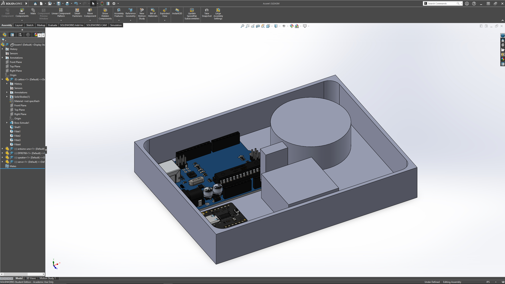

# mp3-Meowers
This projects models a music playing toy using an Arduino and a dedicated mp3 module. 
* MP3 player module with SD card slot - music is loaded on the SD card (see below). The program running on the Arduino uses the serial interface of the player to control which mp3 file is played and to control the volume level. Important: This player module has the same pin-out as the DFPlayer device, but its functionality is not exactly the same.
* Arduino UNO R3 - The code of this repo runs on this device. You could use just about any Arduino or micro for this function. The program monitors the switch inputs and controls the player module accordingly

## Circuit 

Components:  
* Arduino Uno R3
* DFPlayer Mini
* 32Gb MicroSD Card
* 4Ohm 3W 2" Speaker
* Servo Motor
* 3X Momentary Switch

## SD card Content 

The DFPlayer is very picky about how files are stored within the MicroSD card to access, read, and play MP3 files. The sample rate also cannot be higher than 44.1KHz 

The most common method and one I chose to follow is having all mp3 files in the root directory and naming every mp3 file in the following convention 

001_xx, 002_xx, 003_xx, ... 010_xx... and so on with xx optionally describing that file. 

## Button Functionality 

Each Button serves its function which is defined by the software sketch. 
- ServoSwitch - This switch starts the function that starts the movement of the toy that is controlled by the Servo
- PlaySwitch - This switch starts or stops the currently assigned mp3 file.
- SkipSwitch - This switch moves on to the next mp3 file. 

## Enclosure design 

First drawn to accommodate all desired functionality, then revised and modeled on SOLIDWORKS to accommodate measurements and design changes. 

